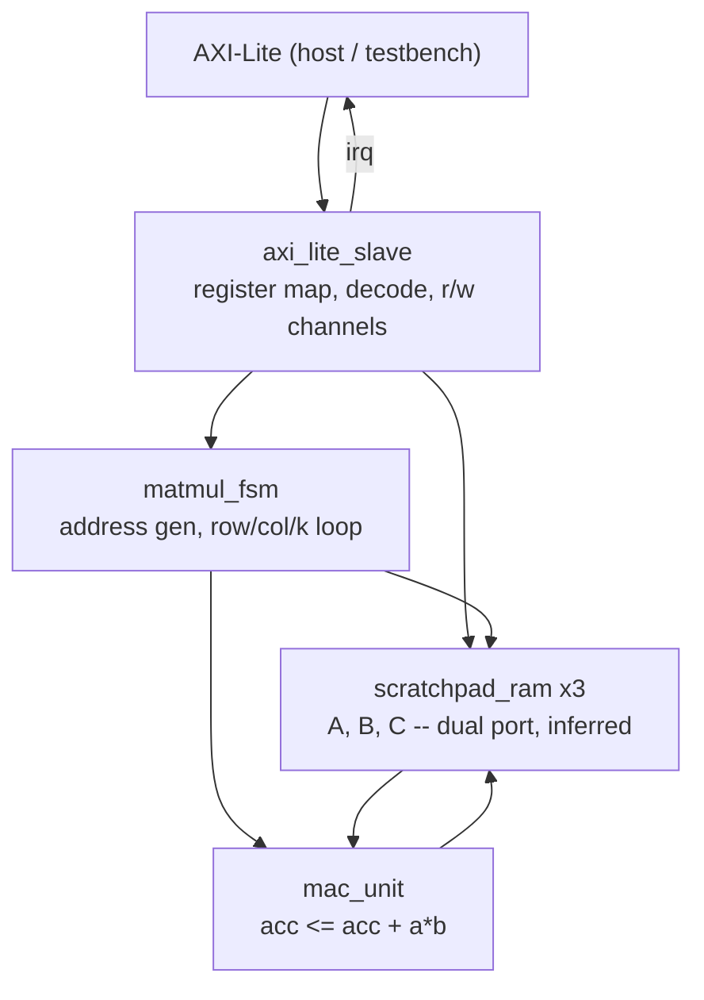

# AXI-Lite Matrix Multiplier Accelerator

Third project in my hardware portfolio, after the RISC-V core and the [NoC router](https://github.com/AlanGabriel-CS/noc_router_project). I scaled this one down from a systolic array to a single-core MAC-based design on purpose — the goal here is clean AXI-Lite register-interface integration, memory addressing, and control FSM design, not spatial routing across a grid. It's scoped to a solid third-year computer engineering course level and built to run entirely in simulation (Icarus Verilog + cocotb) — no FPGA board or synthesis step.

What I'm proudest of: `mac_unit` silently treated every matrix element as unsigned for most of this project's life, which means every product involving a negative operand would've been wrong — not a crash, just quietly incorrect output. A regression case built specifically to exercise negative values caught it before it ever shipped. More on that below.

**Status: Complete.** `axi_lite_slave` + `scratchpad_ram`, and `matmul_fsm` + `mac_unit` sequencing, are implemented and passing a 5-case cocotb regression against `numpy.dot()` -- square, non-square, negative operands, K=1, and a 9x9x9 case that uses 243 of the scratchpad's 256 words. See Roadmap at the bottom for the full checklist.

## Overview

A host writes matrix dimensions and scratchpad base addresses through an AXI-Lite register interface, sets a start bit, and the accelerator computes `C = A x B` using a single shared multiply-accumulate unit, sequenced by a control FSM that walks the row/column/inner-product loops. Completion is signaled two ways at once: a `DONE` status bit for a host that wants to poll, and a level-held `irq` output for a host that wants to wait on an interrupt instead.

## Architecture

```
        AXI-Lite (host / testbench)
               |
       axi_lite_slave  --irq--> (host)
   (register map, decode, r/w channels)
               |
       +-------+-------+
       |               |
   matmul_fsm      scratchpad_ram x3
 (address gen,      (A, B, C -- dual
  row/col/k loop)    port, inferred)
       |               |
       +-------+-------+
               |
           mac_unit
   (acc <= acc + a*b)
```

<details>
<summary>Prettier version (renders on GitHub)</summary>



</details>

**Register map** (word-addressed, 32-bit registers):

| Offset | Name          | Fields                                                     |
|--------|---------------|-------------------------------------------------------------|
| 0x00   | CTRL_STATUS   | bit 0 START (W1P), bit 1 BUSY (RO), bit 2 DONE (RO/W1C)     |
| 0x04   | DIMS          | [7:0] N, [15:8] K, [23:16] M                                |
| 0x08   | BASE_ADDR_A   | scratchpad word offset for matrix A                          |
| 0x0C   | BASE_ADDR_B   | scratchpad word offset for matrix B                          |
| 0x10   | BASE_ADDR_C   | scratchpad word offset for matrix C                          |
| 0x14   | SCRATCH_SEL   | [1:0] selects the load/read-back target: 0=A, 1=B, 2=C       |
| 0x18   | SCRATCH_ADDR  | word address within the selected scratchpad; auto-increments on every WDATA write or RDATA read |
| 0x1C   | SCRATCH_WDATA | W-only: stores the word at scratch[SEL][ADDR], then ADDR++    |
| 0x20   | SCRATCH_RDATA | R-only: returns scratch[SEL][ADDR], then ADDR++ (one extra read-latency cycle vs. the plain registers above) |

`BASE_ADDR_C` extends the register map by one word beyond the original 4-register plan: two base addresses alone can't independently locate three separate scratchpads, so C gets its own rather than sharing A's or B's address space.

**Completion: `irq` plus `DONE`, not `DONE` alone.** The original spec called for a "completion interrupt/status flag" -- for a while this only had the status-flag half, `DONE`, polled from `CTRL_STATUS`. `irq` is a real top-level output now, wired straight to the same `done_reg` that drives the `DONE` bit, so it's level-held and clears on the exact same event (a new `START`, or a W1C write to `CTRL_STATUS` bit 2) -- a host can pick either polling or interrupt-driven completion and the two will never disagree, because there's only one underlying register.

**Scratchpad pre-load path.** A host loads a matrix by writing `SCRATCH_SEL` + `SCRATCH_ADDR` once, then streaming values through `SCRATCH_WDATA` (the address auto-increments after each write). Reading `C` back works the same way through `SCRATCH_RDATA`. This rides on scratchpad port A, which faces the AXI-Lite side; port B faces the MAC datapath via `matmul_fsm`, so pre-load and computation use physically separate ports on the same dual-port RAM.

**Datapath.** `C_ij = sum_k(A_ik * B_kj)`, computed over a shared `mac_unit` rather than an array of multipliers — that's the whole point of scoping this down from a systolic array. `matmul_fsm` is responsible for clearing the accumulator at the start of each `(i, j)` pair, feeding `k` operand pairs from the A/B scratchpads in sequence, and writing the accumulated result to C once the inner loop finishes. Each `k` term costs two cycles, not one: `scratchpad_ram`'s read port is synchronous, so the FSM spends a cycle driving the address (`FETCH`) and a separate cycle consuming the now-valid data into the accumulator (`ACCUM`) rather than overlapping the two. That's a real throughput cost I'm accepting on purpose — correctness and a simple, easy-to-read FSM over squeezing out an extra 2x, matching this project's actual scope.

**The signed-arithmetic bug.** This is the one I'm most pleased with catching. `mac_unit`'s `a`/`b`/`acc` were declared as plain unsigned `logic`. A width-extending cast on an unsigned value zero-extends it — so a negative 32-bit matrix element read into `a` or `b` wasn't sign-extended into the 64-bit accumulator, it was reinterpreted as a huge positive number instead. The multiply would silently produce a wildly wrong product, with no crash, no assertion, nothing to flag it — just a wrong number sitting in `C`. Every test I'd written up to that point used non-negative values, so it passed clean and looked done. It only surfaced once I deliberately wrote a regression case using negative operands (`test_matmul_negative_values`, range -8..7) specifically because "small non-negative integers only" felt like too narrow a net for something calling itself a general matrix multiplier. Fixed by declaring `a`/`b`/`acc` `signed`, so the width-extending cast sign-extends instead. Lesson: a passing test suite only proves what it actually tries to break.

## Verification

```
test_matmul.py (cocotb)
  reset_dut -- AXI-Lite handshake helpers (write/read) -- load_matrix / read_matrix
        |
        v
  run_matmul_case(n, k, m, value range, seed)
    load A, B into scratchpads --> DIMS/BASE_ADDR_* --> START
    --> poll CTRL_STATUS for DONE --> read C back --> assert == numpy.dot(A, B)
```

**Test plan.** Five directed cases, each picked to break a specific assumption rather than just re-rolling random dice on the same shape:

- `test_matmul_basic` — 4x4x4, small non-negative values. The happy path.
- `test_matmul_non_square` — 3x5x2 (N != K != M), so a bug that only shows up when the address math can't assume symmetric dimensions has somewhere to hide.
- `test_matmul_negative_values` — the case that actually caught the signed-arithmetic bug described above.
- `test_matmul_k_equals_one` — the inner FETCH/ACCUM loop's boundary: exactly one iteration, straight to write-back. Off-by-one loop bounds love to hide at K=1.
- `test_matmul_near_scratchpad_depth` — 9x9x9, 243 of the scratchpad's 256 words used across A/B/C. Address math that works fine at small offsets can still overflow or alias once addresses actually get large.

Every case above also checks `irq`: low before `START`, high the instant `DONE` is observed, and cleared by the same W1C write that clears `DONE`.

**Reference model.** `numpy.dot()` on the exact same operand matrices the testbench loads into the scratchpads — an exact-match assertion on the full result matrix, not a spot-check on a few elements.

**Waveforms.** `WAVES=1 make` (cocotb's built-in Icarus support) dumps `dv/sim_build/matmul_top.fst`. Wired up and confirmed to produce a valid trace, but nothing's currently broken to chase down with it.

## Repository Structure

```
rtl/
  axi_lite_slave.sv    AXI-Lite register interface (map above)
  scratchpad_ram.sv    dual-port RAM wrapper, one instance per matrix
  mac_unit.sv           single multiply-accumulate block
  matmul_fsm.sv          control FSM: address generation + MAC sequencing
  matmul_top.sv          top-level integration

dv/
  Makefile              cocotb sim Makefile (defaults to Icarus)
  test_matmul.py         cocotb testbench, numpy.dot() as the reference model
```

## Build & Run

Requires a Verilog simulator (Icarus Verilog or Verilator) and cocotb. cocotb 2.0.1 caps out at Python 3.13, so if your default `python3` is newer than that (mine's 3.14), point the venv at an older interpreter instead of failing silently:

```bash
python3.10 -m venv .venv   # or any Python <=3.13
source .venv/bin/activate
pip install cocotb numpy
cd dv
make
```

## Roadmap

- [x] Module boundaries and port lists for all five RTL blocks
- [x] Register map drafted
- [x] cocotb testbench structure (clock/reset, AXI-Lite write/read helpers, numpy reference)
- [x] AXI-Lite slave: address decode, register file, read-data mux
- [x] Scratchpad pre-load path (SCRATCH_SEL/ADDR/WDATA/RDATA registers, port A of each scratchpad)
- [x] `matmul_fsm`: row/column/k-loop address generation, MAC sequencing, write-back
- [x] Real testbench result comparison (SCRATCH_RDATA read-back vs. `numpy.dot()`) -- passing on a square (4x4x4) and a non-square (3x5x2) case
- [x] `mac_unit` signed-arithmetic fix: `a`/`b`/`acc` were plain unsigned `logic`, so a negative operand got zero-extended into the 64-bit accumulator instead of sign-extended, corrupting any product with a negative operand. Caught by the negative-values regression case below, fixed by declaring them `signed`.
- [x] Broader regression: non-square (3x5x2), negative operands (-8..7), K=1, and 9x9x9 (243/256 scratchpad words) -- 5/5 passing
- [x] FST waveform dump wired (`WAVES=1 make`, cocotb's built-in Icarus support) and verified it produces a valid trace -- nothing's currently broken to chase down, so this is capability-verified rather than an active debug session; open `dv/sim_build/matmul_top.fst` in GTKWave to look yourself
- [x] Repo docs cleanup (LICENSE, verification narrative, mermaid diagram, debugging write-up) + push
- [x] `irq` output: the original scope called for "completion interrupt/status flag" but only the status-flag half existed. Added a real `irq` port wired to the same `done_reg` as `DONE`, plus a regression check on every test case that it asserts on completion and clears on the W1C clear.
